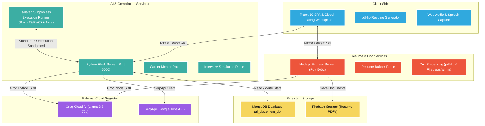

# <p align="center">🤖 AI Career Pro: Unified Interview & Mentor System</p>

<p align="center">
  
  
  
  
  
</p>

<p align="center">
  <strong>An intelligent, multi-service career development ecosystem powered by Groq Cloud AI.</strong>
  <br />
  Integrating high-performance voice-interactive career mentoring, deep ATS resume diagnosis, role-specific dynamic interview simulation, isolated multi-language code execution, and real-time smart job recommendations.
</p>

---

## 🧭 Table of Contents

- [🌟 Core Capabilities](#-core-capabilities)
  - [1. Pro-Interactive Multilingual Voice Mentor](#1-pro-interactive-multilingual-voice-mentor)
  - [2. Groq-Powered Resume Hub](#2-groq-powered-resume-hub)
  - [3. Dynamic AI Interview Simulation](#3-dynamic-ai-interview-simulation)
  - [4. AI Coding Interview Engine](#4-ai-coding-interview-engine)
  - [5. Live Job Recommendations](#5-live-job-recommendations)
  - [6. Career Personalization Profile](#6-career-personalization-profile)
- [🏗️ Architectural Architecture](#%EF%B8%8F-architectural-architecture)
- [🛠️ Unified Technology Stack](#%EF%B8%8F-unified-technology-stack)
- [📂 Directory Blueprint](#-directory-blueprint)
- [🚀 Getting Started](#-getting-started)
  - [Prerequisites](#prerequisites)
  - [1. Clone Repository](#1-clone-repository)
  - [2. Python Backend Setup](#2-python-backend-setup)
  - [3. Node.js Backend Setup](#3-node-js-backend-setup)
  - [4. React Frontend Setup](#4-react-frontend-setup)
- [🏃 Running the System](#-running-the-system)
- [🛡️ Security & Sandbox Standards](#%EF%B8%8F-security--sandbox-standards)
- [✍️ Author & Credits](#%EF%B8%8F-author--credits)

---

## 🌟 Core Capabilities

### 1. Pro-Interactive Multilingual Voice Mentor
* **Global Floating Workspace**: Accessible sitewide as a professional **600px x 750px** overlays, ensuring users have real-time guidance whenever and wherever they need it.
* **Native Multi-Language Support**: Complete conversational support for **9+ regional and global languages**, including English, Hindi, Telugu, Tamil, Kannada, Malayalam, Marathi, Bengali, and Gujarati.
* **Voice-to-Voice Interaction**:
  * **Smart STT (Speech-to-Text)**: Highly responsive client-side speech capturing accompanied by live CSS audio visualizers.
  * **Intelligent Auto-Submit**: Detects periods of silence to automatically process and fire queries without requiring manual clicks.
  * **Localized TTS (Text-to-Speech)**: Real-time, ultra-clear synthesized speech feedback formatted precisely for regional accents and settings.
* **Multi-Turn Persistent Memory**: Equipped with specialized session logs allowing the mentor to retain context, remember past questions, and guide candidates incrementally.
* **Clarity-Driven Guidance**: Synthesizes highly structured, double-spaced, emoji-enriched markdown points tailored for cognitive ease and high readability.

### 2. Groq-Powered Resume Hub
* **Sub-Second Deep Audit**: Powered by **Llama 3.3-70b** via **Groq Cloud AI**, producing extensive resume evaluations in under a second.
* **Interactive ATS Optimizer**: Evaluates industry relevance, computes compatibility coefficients, scans for target keywords, and surfaces actionable skill gaps.
* **8-Step Resume Builder Wizard**: Step-by-step assistant equipped with interactive AI copy-generation for writing compelling professional summaries and technical bullet points.
* **High-Fidelity PDF Engine**: Compiles polished, standardized, ATS-compliant, single-page professional resumes client-side using `pdf-lib`.

### 3. Dynamic AI Interview Simulation
* **Domain-Specific Scenarios**: Real-time behavioral and technical question generation adapting precisely to custom engineering fields (CSE, ECE, ME, Civil, etc.).
* **Immediate Grade Analytics**: Analyzes answers dynamically to provide a detailed score card, highlighting strong points, logic flaws, and ideal sample answers.

### 4. AI Coding Interview Engine
* **Contextual Code Challenges**: Generates unique algorithmic problems tailored to candidate experience and target developer profile (Frontend, Fullstack, DevOps, Data Science).
* **Multi-Tiered Difficulty Levels**: Selectable challenges categorized under **Easy, Medium, and Hard** to simulate real-world technical assessments.
* **Universal Compiler & Code Runner**: Supports isolated runtime validation for **Python, JavaScript, Java, C++, and Bash** with strict memory and execution timeouts.
* **Post-Submit AI Code Review**: Detailed visual reports evaluating time/space complexity, modularity, edge cases, and architectural best-practices.

### 5. Live Job Recommendations
* **SerpApi Google Jobs Pipeline**: Pulls fresh, actual, real-world job openings matching candidate career preferences.
* **AI Match Score**: Checks resume profiles against active job criteria to provide direct fit metrics, highlighting exactly why you are (or aren't) a match.
* **Direct Apply**: One-click external links straight to official corporate recruiting portals.

### 6. Career Personalization Profile
* **Academic Specialization Alignment**: Standardizes career advice based on deep engineering branch models (CS, EE, ME, etc.).
* **Global Configuration State**: Stores goals, preferences, and interview feedback, allowing both the AI Mentor and mock interviewers to adapt to your growth.

---

## 🏗️ Architectural Architecture

This application employs a high-performance decoupled multi-service architecture, connecting a responsive React frontend with dedicated Node.js and Python servers.



---

## 🛠️ Unified Technology Stack

### Frontend Client
* **Framework**: React 19 (Hooks, Context API, stateful layouts)
* **Styling & Theme**: Tailwind CSS (Sophisticated glassmorphism, responsive grid systems)
* **Animations**: Framer Motion (Fluid transitions, micro-interactions, float states)
* **Iconography**: Lucide React
* **Document Synthesis**: `pdf-lib`

### Python AI & Core Backend
* **Web Framework**: Flask
* **AI Orchestration**: Groq SDK (Connecting Llama-3.3-70b-Versatile & Llama-3.1-8b-Instant)
* **Search Engine Integration**: SerpApi (Dynamic jobs integration)
* **Natural Language Processing**: SpaCy
* **Database Driver**: PyMongo (MongoDB Integration)
* **Runtime Orchestrator**: Subprocess-based secure environment runner

### Node.js Documents Backend
* **Web Framework**: Express
* **Document Architecture**: PDF-Lib
* **Cloud Storage & Security**: Firebase Admin SDK
* **AI Integration**: Groq Node SDK

---

## 📂 Directory Blueprint

```text
📁 Ai-Interview-System/
├── 📁 frontend/                # React 19 Frontend Application
│   ├── 📁 public/              # Static Assets & Configurations
│   └── 📁 src/
│       ├── 📁 components/      # UI: Global Voice Mentor, Resume Wizards, Code Editors
│       ├── 📁 context/         # Centralized User State & Global Hooks
│       └── 📄 App.js           # Core Routing & Layout Setup
│
├── 📁 backend/                 # Python AI Core & Sandboxed Compiler Services
│   ├── 📁 routes/              # Career, Coding, Profile & Interview API Endpoints
│   ├── 📁 services/            # Groq Service Wrapper, Subprocess Code Exec, SerpApi
│   ├── 📁 models/              # Schema Configurations & Database Structuring
│   ├── 📁 utils/               # Sanitizers, Constants & Helper Systems
│   └── 📄 app.py               # Main Flask Server Entry Point
│
└── 📁 node-backend/            # Node.js Document & Auth Middleware Services
    ├── 📁 routes/              # AI Resume Auditing & ATS Scoring
    ├── 📁 config/              # Firebase & Database Initialization
    └── 📄 server.js            # Main Express Server Entry Point
```

---

## 🚀 Getting Started

### Prerequisites
Before starting, ensure you have the following installed on your machine:
* **Node.js** (v18 or higher)
* **Python** (3.9 or higher)
* **MongoDB** (Local Community Server or MongoDB Atlas instance running)

---

### 1. Clone Repository
```bash
git clone https://github.com/Sachin1817/Ai-Interview-System.git
cd Ai-Interview-System
```

---

### 2. Python Backend Setup
Navigate to the `backend` folder, set up a python virtual environment, and install dependencies:

```bash
cd backend
python -m venv venv
venv\Scripts\activate  # On Windows PowerShell/Command Prompt
# For Linux/macOS use: source venv/bin/activate

pip install -r requirements.txt
python -m spacy download en_core_web_sm
```

Create a `.env` file inside the `backend` directory and add the following keys:
```env
PORT=5000
GROQ_API_KEY=your_groq_cloud_api_key_here
SERP_API_KEY=your_serp_api_job_search_key_here
MONGO_URI=mongodb://localhost:27017/ai_placement_db
```

---

### 3. Node.js Backend Setup
Navigate to the `node-backend` folder, install npm modules, and construct a environment profile:

```bash
cd ../node-backend
npm install
```

Create a `.env` file inside the `node-backend` directory and add:
```env
PORT=5001
GROQ_API_KEY=your_groq_cloud_api_key_here
# Optional if saving PDFs online:
# FIREBASE_SERVICE_ACCOUNT_KEY=path_to_firebase_json
```

---

### 4. React Frontend Setup
Navigate to the `frontend` folder, install required packages:

```bash
cd ../frontend
npm install
```

Ensure Tailwind and standard React packages compile cleanly.

---

## 🏃 Running the System

To fully experience **AI Career Pro**, start the services concurrently. Open three separate terminal screens and fire the commands:

### Terminal 1: Python AI Core Server
```bash
cd backend
venv\Scripts\activate
python app.py
```
*Server runs at: `http://localhost:5000`*

### Terminal 2: Node.js Resume Server
```bash
cd node-backend
npm start  # or npm run dev if configured
```
*Server runs at: `http://localhost:5001`*

### Terminal 3: React Frontend Client
```bash
cd frontend
npm start
```
*Client compiles and opens automatically at: `http://localhost:3000`*

---

## 🛡️ Security & Sandbox Standards

### Subprocess Execution Safety
* **Resource Isolation**: Subprocesses are executed within rigorous time parameters (e.g., maximum 5-second CPU runtimes) preventing infinite loops from locking backend threads.
* **Standard Output Capture**: High-efficiency capture of `stdout` and `stderr` without exposing shell variables or enabling interactive system write commands.
* **Strict Memory Caps**: System-enforced size parameters prevent memory-bomb scripts from impacting host hardware.

### AI Prompt Failsafes
* **System Instruction Reinforcements**: All Groq prompts are injected with immutable developer-level instructions to stop prompt injection vectors.
* **No Direct Prompt Passthroughs**: User inputs undergo structured sanitization before processing by the Llama reasoning engine.

---

## ✍️ Author & Credits

Developed with ❤️ by **[Sachin D](https://github.com/Sachin1817)**.

* Special thanks to the **Groq AI Team** for providing sub-second LLM inference speeds that make real-time voice mentoring fluid and highly reactive.
* Powered by the **Llama 3.3** architecture.

---
<p align="center">
  Give this repository a ⭐ if you found it useful or if it helped you land your next engineering role!
</p>